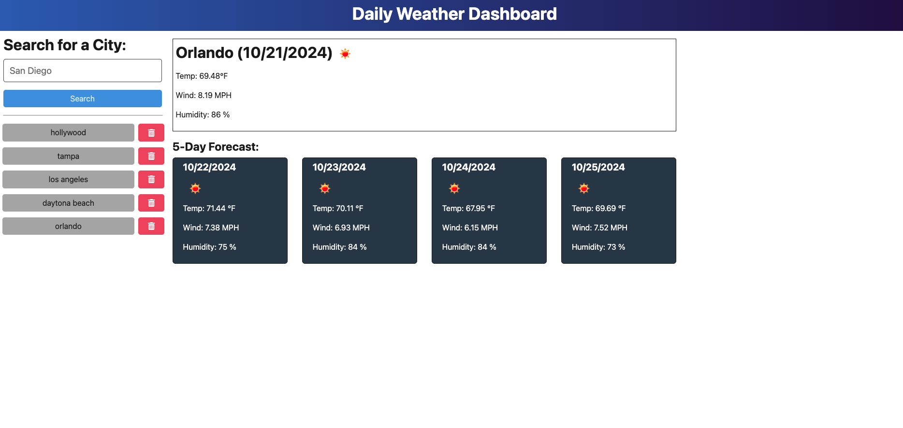

# Daily-Weather
## Description
This application allows a traveling user to view a 5 day forecast at any location, so that they can plan a trip and activities accordingly. The cities that are searched, are saved to recent searches, and can also be deleted using the button. The weather data displayed shows the temperature, conditions, humidity percentage, and wind speed.
## Table of Contents
   * [Installation](#installation)
   * [Usage](#usage)
   * [Tests](#tests)
   * [License](#license)
   * [Contribution](#contribution)
## Installation
After cloning the repository, obtain your own API key at openweathermap.org. To install, type in the command line "npm install express". If inquirer is already installed and listen in the package.json file, type "npm install". To run, enter "npm run start". 
## Usage
Once you are on the application, you can search any city you want in the search bar. You will see the weather conditions for the next day, and for the following five days after that. You can also pick a city from what has been previously searched, or delete a city from that list.

Link to deployed application:
https://daily-weather-wapc.onrender.com

## Tests
Tested using Insomnia application
## License

## Contribution
* Github: [Link to profile](https://github.com/victoriamata)
* Email: victoriamataxo@gmail.com